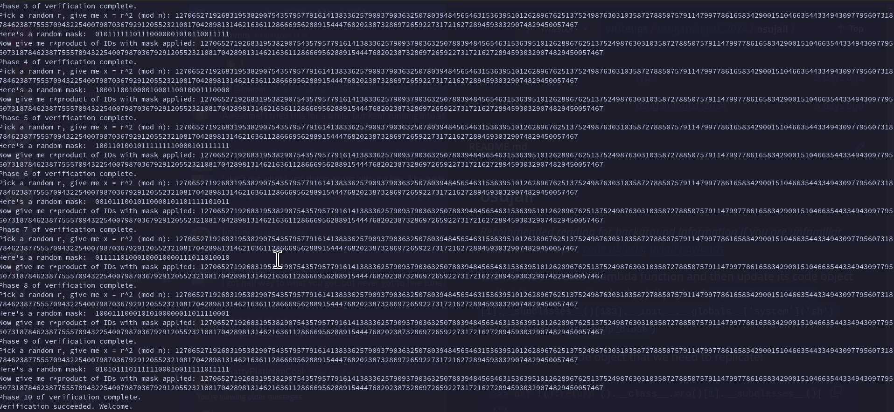

# Osu!CTF 2024

| Name   | Korean Offline Mafia |
| ---- | ---- | 
| Category | Crypto |
| Author | quin |
| Solves | 111 | 
| Description | I've been hardstuck for years, simply not able to rank up... so I decided to try and infiltrate the Korean offline mafia for some help. I've gotten so close, getting in contact, but now, to prove I'm part of the group, I need to prove I know every group member's ID (without giving it away over this insecure communication). The only trouble is... I don't! Can you help? |
| Attachments | [server.py](./server.py)

## Inspecting the code

```py
from topsecret import n, secret_ids, flag
import math, random

assert all([math.gcd(num, n) == 1 for num in secret_ids])
assert len(secret_ids) == 32

vs = [pow(num, 2, n) for num in secret_ids]
print('n =', n)
print('vs =', vs)

```


Note a few observations we can make: 
 - There are 32 secret IDs in `secret_ids`
 - All the ids in `secret_ids` are relatively prime to `n` (aka gcd(id, n) == 1)
 - Furthermore, `vs` the array that holds `id^2 % n` is also relatively prime to `n` (by some neat number theory properties)
 - We are only given `n`, and the array `vs`

I suspect the reason for the relatively prime check is to ensure the product is not zero (more on this later).      

Now, let's look at the rest of the code. 

```py
correct = 0

for _ in range(1000):
	x = int(input('Pick a random r, give me x = r^2 (mod n): '))
	assert x > 0
	mask = '{:032b}'.format(random.getrandbits(32))
	print("Here's a random mask: ", mask)
	y = int(input('Now give me r*product of IDs with mask applied: '))
	assert y > 0
	# i.e: if bit i is 1, include id i in the product--otherwise, don't
	
	val = x
	for i in range(32):
		if mask[i] == '1':
			val = (val * vs[i]) % n
	if pow(y, 2, n) == val:
		correct += 1
		print('Phase', correct, 'of verification complete.')
	else:
		correct = 0
		print('Verification failed. Try again.')

	if correct >= 10:
		print('Verification succeeded. Welcome.')
		print(flag)
		break

``` 

Let's take this bit by bit. There's a loop with a 1000 iterations (interesting.). In one of these iterations, we are asked for an input `x` such taht it can be expressed as `r^2 (mod n)`. 

Next, a 32-bit mask is generated and shown to the user. The idea is that you multiply every ID where the corresponding bit in the mask is `1`.

We are asked to input `y` or rather our random number `r` times the `product of the ids with the mask applied`. 

Our value of `y` is squared and compared against the secret value. We need to get this right 10 times out of the 1000 chances in order to get the flag. 


#### An expression for `y` 

With the information we have, we can craft an implicit expression for `y`

$$y^2 \equiv x \cdot vs_{m_0} \cdot vs_{m_1} \cdot vs_{m_2} \cdot ...   \cdot vs_{m_31} \text{ (mod n)}$$ 

where $m_i$ is the mask bit at index $i$ and, 
$$
 vs_{m_i} = 
 \begin{cases}
  vs_i & \text{ if } m_i = 1 \\ 
  0 & \text{ if }  m_i = 0 
 \end{cases}
$$


## Strategy Time!

It is clear from the previous section that the true variable within our variables is likely to be `x` (again, I say this is clear but it took me an embarassing amount of time to figure out lol). 

One idea is to use `x` and maybe `vs` to force `value` to be something trivial like `0` or `1`. Unfortunately, it seems we can't make `x == 0` due to the assertion that `x > 0` . 

### Aside: A fun unintended solution
Note that although `x > 0`, it doesn't actually check that `x % n != 0`. Given that $n \equiv 0 \text{ (mod n)}$. Observe if $x = n$, we have that


$$
\begin{align*}
y^2 &\equiv x \cdot vs_{m_0} \cdot vs_{m_1} \cdot vs_{m_2} \cdot  \cdot vs_{m_31} \text{ (mod n)} \\
&\equiv 0 \cdot vs_{m_0} \cdot vs_{m_1} \cdot vs_{m_2} \cdot  \cdot vs_{m_31} \text{ (mod n)} \\
&\equiv 0 \text{ (mod n)}
\end{align*}
$$ 

So, $y \equiv 0 \equiv n \text{ (mod n)}$. Thus, by sending `x = n` and `y = n` about 10 times, we get a flag. 
 



Alright, now I presume that there should have been a check that asserts that your inputs are not multiples of n either. 

## Back to your regular programming

If we can predict what our `mask` would be before we provide `x`, then we can enter an `x` such that $y^2 \equiv 1 \text{ (mod n)}$. In other words, we need to choose `x` such that

$x \cdot vs_{m_0} \cdot vs_{m_1} \cdot vs_{m_2} \cdot ... \cdot vs_{m_31} \equiv 1 \text{ (mod n)}$

This value of $x$ can be trivially found through a simple modular inverse. 


## unTwisting this mess

A big red flag in this code is the use of the python's `random` module for security. The python `random` uses a Mersenne Twister PRNG which can be predicted through the statistical analysis of a few hundred random numbers. Remember how it was quite strange for the challenge to give us a 1000 chances and only expect us to get 10 right? Well, it seems like we found out why. 

### I love RandCrack 

This is a tool that does all the boring statistical analysis for us.

[https://github.com/tna0y/Python-random-module-cracker](https://github.com/tna0y/Python-random-module-cracker)

The usage is pretty simple and is detailed in its `README.md`.

### Ugh this is long, can we solve this already? 


Yes, we can. Here's our solve script:

```py 
from pwn import *
from randcrack import RandCrack
from tqdm import tqdm
import json

rc = RandCrack()

# Solving their PoW 
p = remote('chal.osugaming.lol', 7275)
p.recvuntil(b'proof of work:\n')
proc = subprocess.Popen(p.recvline().decode(), shell=True, stdout=subprocess.PIPE)
stdout, _ = proc.communicate()
p.send(stdout)

p.recvuntil(b"n = ")
n = int(p.recvline().decode(), 10)

p.recvuntil(b'vs = ')
vs = json.loads(p.recvline().decode())


for i in tqdm(range(624), desc="RandCrack progress"):
    p.sendlineafter(b"Pick a random r, give me x = r^2 (mod n): ", b"1")
    p.recvuntil(b"Here's a random mask:  ")
    mask = int(p.recvline().decode(), 2)
    rc.submit(mask)
    p.sendlineafter(b"Now give me r*product of IDs with mask applied: ", b"1")

for i in range(10):
    mask = '{:032b}'.format(rc.predict_getrandbits(32))
    val = 1
    for i in range(32):
    	if mask[i] == '1':
            val = (val * vs[i]) % n
    # find modular inverse of value
    x = str(pow(val, -1, n)).encode()

    p.sendlineafter(b"Pick a random r, give me x = r^2 (mod n): ", x)
    p.sendlineafter(b"Now give me r*product of IDs with mask applied: ", b"1")

    info(p.recvline().decode())
info(p.clean().decode())

```


