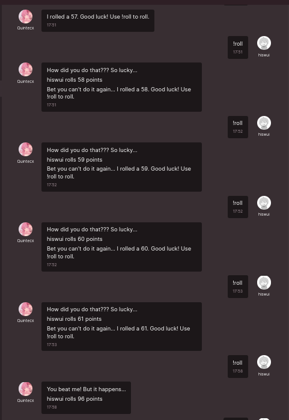
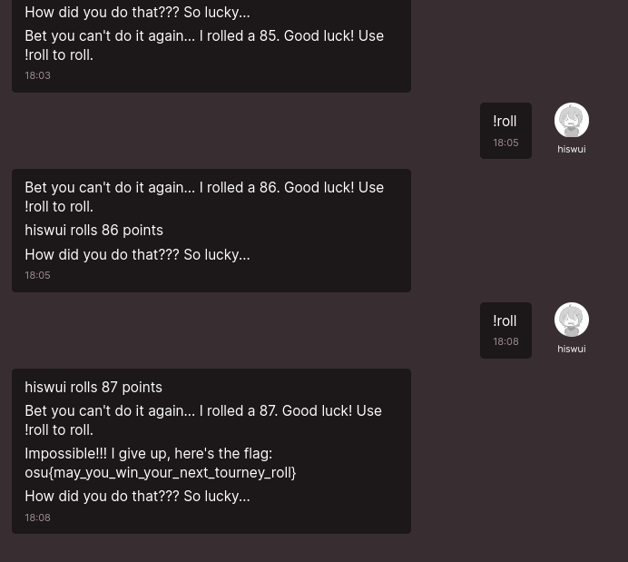

# Osu!CTF 2024

| Name   | Roll |
| ---- | ---- | 
| Category | Crypto |
| Author | quin |
| Solves | 22 | 
| Description | To help you in your next tourney, you can practice rolling against me! But you'll have to do better than just winning the roll to impress me...  (DM me !help on osu! to get started!) |
| Attachments | [main.rs](./dist/src/main.rs)

## Challenge Overview

The challenge has some simple mechanics (like any bot). There are three commands you can make:

- `!help` : Just returns a helpful message on the other commands available to you 
- `!start`: Starts a game of rolling some dice [1, 100]. The goal of the game is to roll a higher number than the bot to win
- `!roll`: Rolls your die [1, 100] for your turn.

There are a few caveats for the flag though:
- You must not roll less than the bot at any time. 
- You must roll **exactly** one more than the bot. (i.e. if the bot rolls a 67, you must roll a 68). If you roll any higher, the game terminates saying you won and that you're boring
- You must get this special roll five times in a row. 

## Inspecting the code

Here is some of the relevant source code for the challenge:

```rs
use futures::prelude::*;
use irc::client::prelude::*;
use log::{error, info, LevelFilter};
use rand::rngs::SmallRng;
use rand::{Rng, SeedableRng};
use simple_logger::SimpleLogger;
use std::fs;
use std::time::{SystemTime, UNIX_EPOCH};
use std::collections::HashMap;

fn get_roll() -> i32 {
    let seed = SystemTime::now()
        .duration_since(UNIX_EPOCH)
        .unwrap()
        .as_secs();
    let mut rng = SmallRng::seed_from_u64(seed);
    rng.gen_range(1..101)
}

struct UserState {
    roll_to_beat: i32,
    wins: i32,
}

struct Bot {
    flag: String,
    state: HashMap<String, UserState>,
    client: Client,
}


#[tokio::main]
async fn main() -> irc::error::Result<()> {
    SimpleLogger::new()
        .with_level(LevelFilter::Info)
        .init()
        .unwrap();
    let flag = fs::read_to_string("flag.txt").expect("Unable to read flag file");
    let mut bot = Bot {
        flag,
        state: HashMap::new(),
        client: Client::new("config.toml").await?,
    };

    match bot.run().await {
        Ok(_) => info!("Bot exited successfully"),
        Err(e) => error!("Bot exited with error: {}", e),
    }

    Ok(())
}
```

First of all, it's Rust. How fun and readable!

It seems like the bot uses IRC to communicate with the user. However, I just made my Osu! account and didn't have access to IRC so I had to stick with the slower web chat.

The biggest red flag in this code is the `get_roll()` function. I am not very proficient at using Rust. However, it's quite alarming to use time in seconds (as opposed) to milliseconds for the seed to your RNG. 

This means that we can probably exploit this bot a timing attack since there's a large leeway of a whole second (forever in computer years). If you send a message at the right time within the second, you can predict your roll. 

## The very janky first attempt

Using some online resources and the source code, I quickly cobbled together the following code:

```rs

extern crate rand;

use rand::rngs::SmallRng;
use rand::{Rng, SeedableRng};
use std::time::{Duration, SystemTime, UNIX_EPOCH};
use std::thread;


fn get_roll(value: u64) -> i32 {
    let _seed = SystemTime::now()
        .duration_since(UNIX_EPOCH)
        .unwrap()
        .as_secs();
    let mut rng = SmallRng::seed_from_u64(value);
    rng.gen_range(1..101)
}

fn main() {
    let offset = 1;
    loop {
        thread::sleep(Duration::from_secs(1));
        let mut seed = SystemTime::now()
            .duration_since(UNIX_EPOCH)
            .unwrap()
            .as_secs();
            seed += 1;
        let current_roll = get_roll(seed + offset);
        println!("{}", current_roll)
    }
}
```

The above snippet prints out the expected value for roll every second (offset by the next second to account for human reaction time). So, my job was pretty simple. Look around at the output and wait until a roll which is exactly one greater than the bot's roll shows up and send `!roll` to the chat.

Unfortunately...



\*sigh\*. I tried again and again with this method for about 2 hours before I switched tactics (L reaction speed for real).


## Trudging forward with some optimizations

Note that with the previous method, I was hunched over my monitor anxiously waiting for the next number to pop up and praying in my skills to recognize it and act fast. The idea this time was to take the value of roll 40 seconds from now and find the time at which the next 5 five rolls occur. 

```rs
extern crate rand;


use rand::rngs::SmallRng;
use rand::{Rng, SeedableRng};
use std::time::{SystemTime, UNIX_EPOCH};


fn get_roll(value: u64) -> i32 {
    let _seed = SystemTime::now()
        .duration_since(UNIX_EPOCH)
        .unwrap()
        .as_secs();
    let mut rng = SmallRng::seed_from_u64(value);
    rng.gen_range(1..101)
}

fn main() {
    let max_count = 7;
    let mut seed = SystemTime::now()
        .duration_since(UNIX_EPOCH)
        .unwrap()
        .as_secs();
    let offset = 40;
    let mut count = 1;
    let mut prev_roll = get_roll(seed + offset);

    # preventing it from choosing an impossible starting roll like 100
    while prev_roll + max_count - 1 > 100 {
        seed += 1;
        prev_roll = get_roll(seed + offset);
    }
    println!("Roll {}: {}. Timestamp: {}", 1, prev_roll, seed + offset);
    println!("Prev {}. Next: {}", get_roll(seed + offset - 1), get_roll(seed + offset + 1));
    while count < max_count {
        seed += 1;
        let current_roll = get_roll(seed + offset);
        if current_roll == prev_roll + 1 {
            count += 1;
            prev_roll = current_roll;
            println!("Roll {}: {}. Timestamp: {}", count, prev_roll, (seed + offset));
            println!("Prev {}. Next: {}", get_roll(seed + offset - 1), get_roll(seed + offset + 1));
        }
    }
}

```

The astute of you may recognize that I'm actually finding 7 rolls with consecutive numbers. This is because, you must also roll the right number when you start the game with `!start`. Thus, the challenge here is to send 6 well-timed messages (I added 1 more for good measure). I also print out some information about the previous and next roll to get a sense of my timing.

Here is some sample output:

```
Roll 1: 51. Timestamp: 1709847723
Prev 99. Next: 46
Roll 2: 52. Timestamp: 1709847754
Prev 46. Next: 26
Roll 3: 53. Timestamp: 1709847826
Prev 73. Next: 26
Roll 4: 54. Timestamp: 1709847873
Prev 90. Next: 78
Roll 5: 55. Timestamp: 1709847947
Prev 59. Next: 97
Roll 6: 56. Timestamp: 1709848024
Prev 84. Next: 29
Roll 7: 57. Timestamp: 1709848062
Prev 44. Next: 16
```

This was MUCH better. I got to actually look away from my screen and wait out some time. However, I failed again because of poor reaction skills (and partially the server latency associated with the Web Chat).

## The true solution: No more humans

Although I feel that the premise of the challenge was to make you use rust to interact with the server, I refuse to use it. Instead, I used `Selenium` to process the output from my previous solution and automate key clicks.


```py

from selenium.webdriver.common.keys import Keys
from selenium.webdriver.common.by import By
import time
import pause
from selenium.webdriver.remote.webelement import WebElement
from subprocess import Popen, PIPE, STDOUT
import functools
import subprocess
from selenium.webdriver import Firefox

# Return the timestamps to enter commands from the rust program
def get_timestamps() -> list[int]: 
    output = []
    with Popen(["cargo run", "src/main.rs"], shell=True, stdout=PIPE, stderr=STDOUT, text=True) as proc:
        for line in proc.stdout:
            output.append(line) 

    result = []
    for i in range(2, len(output), 2):
        print(output[i].split())
        result.append(int(output[i].split()[-1]))

    print("\n".join(output))

    return result

        
def main():
    # Create new instance of the webdriver with cookies? (it never worked iirc)
    subprocess_Popen = subprocess.Popen
    subprocess.Popen = functools.partial(subprocess_Popen, process_group=0)
    driver = Firefox()
    subprocess.Popen = subprocess_Popen  
    
    # Go to the chat link
    driver.get("https://osu.ppy.sh/community/chat?channel_id=55107714")

    # Give the user 30 seconds to deal with the 2FA on Osu!
    print("GOING TO SLEEP ZZZZZ")
    time.sleep(30)
    print("AWAKE AGAIN")

    # Find the text area element by its name attribute
    text_areas = driver.find_elements(By.TAG_NAME, "textarea")
    text_area = text_areas[0]

    # Time inputs for the rolls
    def try_solve():
        timestamps = get_timestamps()
        print([time.ctime(t) for t in timestamps])
        for i, ts in enumerate(timestamps):
            pause.until(ts)
            print(time.time())
            if i == 0:
                text_area.send_keys("!start")
            else:
                text_area.send_keys("!roll")

            text_area.send_keys(Keys.ENTER)
            print(time.time())

    try:
        try_solve()
    ## A janky way to rerun the rust program and start over.
    except KeyboardInterrupt:
        print("NEW instance")
        try_solve()

```

The driving selenium code is pretty rudimentary: 
 - Run the rust solution from last time
 - Open a browser session to chat with the bot
 - Enter the commands at the right time automatically
 - Some QOL features to restart execution without closing the browser session when there's some latency that messes with the solve.


After about like 7 tries with the above code, I finally got the flag. (The latency was a little cumbersome)




## Thoughts

This was honestly a really cool and fun challenge. Although I wish I had the IRC option, I think I learnt a lot about using selenium and making ~concerning~ creative workarounds to solving issues with logging in. Thank you to Quintec for making this challenge! 


