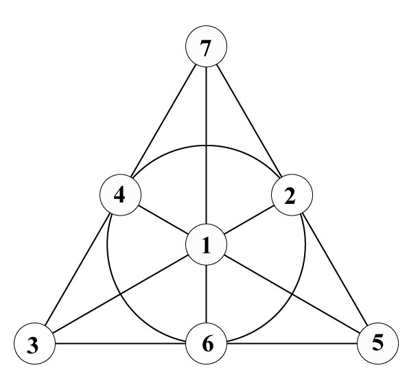
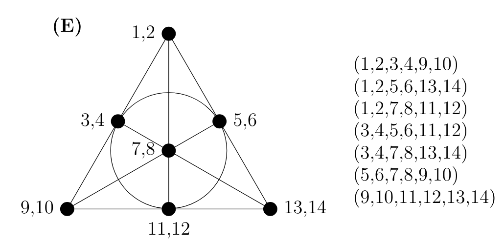
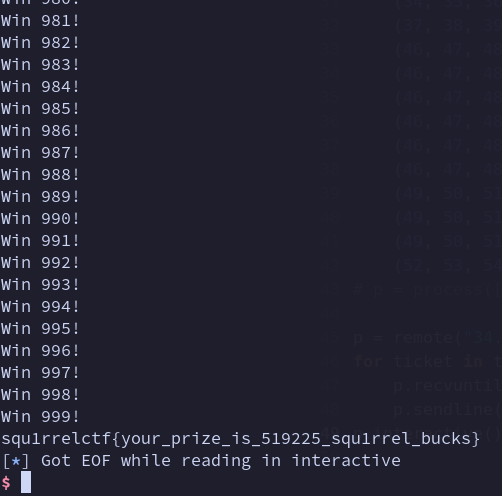

# Squ1rrel CTF 2024
| Name   | Squ1rrel Lottery |
| ---- | ---- | 
| Category | crypto |
| Author | bunny |
| Solves | 23 | 
| Description | Welcome to the squ1rrel lottery! 9 winning numbers will be selected, and if any of your tickets share 3 numbers with the winning ticket you'll win a flag! Hint: This is a math challenge |
| Attachments | [squ1rrel-lottery.py](./squ1rrel-lottery.py)


## Challenge Overview and Inspecting the code

Merging these sections this time since there's not much in the code. From some trivial observations of the source, the
following information can be gathered:

The challenge has a lottery in which:
- The *winning ticket* consists of 9 distinct numbers between 1 and 60 (inclusive). Example: `[32, 57, 58, 2, 36, 3, 11, 22, 54]`
- One ticket or entry to this lottery is also made of 9 numbers like the winning ticket.
- To win a round, our ticket has to match atleast 3 of the 9 numbers on the winning ticket. 
- - *good ticket* example: `[24, 1, 53, 58, 22, 3, 27, 32, 39]` (since 3, 32, and 58 are matching) 
- - *bad ticket* example: `[12, 16, 21, 28, 32, 33, 45, 46, 59]` (there is only one match)

The challenge here is to make 40 tickets such that you are guaranteed there is atleast one good ticket for all possible
winning tickets. The code only tests your tickets against 1000 random winning tickets (so you could get extremely
lucky). 

## Lotto Math is Truly Confusing

As the heading suggests, this challenge hurt my head. With some search-engine surfing, I was able to retrieve this paper
titled [You need 27 tickets to guarantee a win on the UK National Lottery ](https://arxiv.org/abs/2307.12430). As the
title claims, the authors came up with a list of 27 tickets that will guarantee a win in the UK National lottery. What’s
important here is the method through which they found these 27 tickets. To do so, the authors make use of some
projective geometry…

### Stop Finitely Projecting Your Geometry At Me!
This section isn’t entirely relevant to this challenge, but it’s an attempt at summarizing a bunch of the math needed to
understand the previous solution. Firstly, let’s understand what a Fano Plane is (at least a very rudimentary version of
one).



~~Welp, there you go *that* is a Fano plane~~. A Fano plane is a structure that connects 7 points together. The 7 points
are connected to each other via a set of 7 lines.

The seven lines connect the following points in the above image:
- 3-4-7 (the left edge of the triangle)
- 7-2-5 (the right edge of the triangle)
- 3-6-5 (the bottom edge of the triangle)
- 7-1-6 (the perpendicular bisector of the bottom edge)
- 4-1-5 (the perpendicular bisector of the left edge)
- 3-1-2 (the perpendicular bisector of the right edge)
- 4-2-6 (the circle in the middle, yes that’s a line)

The most important property of this structure is that **any 2 points are connected to each other by exactly one line**. Try it.

### A simplified version of the UK National lottery
Suppose that instead of having numbers between 1 and 59, we only had numbers between 1 and 14. We can now construct the
following Fano plane.



Now, let us say that to generate our winning set of tickets, we look at the seven lines of the Fano plane. Each line
connects three pairs of numbers together. So, the numbers on each each line is a ticket. For example, 1, 2, 3, 4, 5, 6
is the ticket generated from the left edge. The rest of the tickets can be found in the figure above.

Recall the special property of these Fano planes from earlier (bolded). Though each point holds extra numbers, it
continues to hold that given any 2 numbers, there exists a ticket that has both numbers. Try to verify this with
yourself: pick 2 numbers between 1 and 14.

### Back to the crushing reality of the actual UK lottery
That was a fun detour. We can finally extend our range of possible numbers back to [1, 59].

Before I continue I want to make a note of what we just learnt: **we constructed 7 tickets such that if any 2 of the
numbers on the winning tickets are in the range [1, 14], we are guaranteed a win.** The paper continues to use the same
strategy by adding two more Fano planes to cover the ranges of [15, 28] and [29, 42], a triangle with a vanishing point
to cover [43, 50], and another traingle to cover [51, 59]. The triangles have similar properties to the Fano Plane (it
doesn’t really matter for this writeup).

We have 5 ranges, namely `[[1, 14], [15, 28], [29, 42], [43, 50], [51, 59]]`, such that if 2 numbers happen to both be
in the range, then we are guaranteed a win. For example, 32, 41 guarantee a win since they are both in [29, 42], whereas
20, 49 would not win because they are in different ranges.

## The Pigeons Are Getting Comfy In Holes 

Since the UK National Lottery ticket has 6 numbers that must be in one of 5 ranges, we have that atleast 2 of the
numbers are present in the same range by the pigeonhole principle. Thus, guaranteeing us a win. It really is that
simple. 

All we need is a set of tickets covering a range [x, y] such that any all possible 2 number combinations in that range
is covered by atleast one ticket in that set. Make 4 more of these sets such that we can exploit the pigeonhole
principle to guarantee ourselves a win.

Here's a video from Matt Parker that does a great/better job at describing this math:
[https://youtu.be/zYkmIxS4ksA?si=FRwwo91eXY_muAb1](https://youtu.be/zYkmIxS4ksA?si=FRwwo91eXY_muAb1)

## What were we talking about again? Oh right, Squ1rrel Lottery.

Back to our original problem (scroll up to refresh yourself on the rules). 

I will admit that this section gets a bit boring with how much I just guessed and happened to hit some nice numbers.

Inspired by the idea from earlier of converting the points of a Fano Plane into pairs of numbers, I chose to represent
all my numbers as triplets instead. In our range [1, 60], we have $\frac{60}{3} = 20$ triplets or points. It follows
that just like how the previous example made tickets from combining 3 pairs together, we can form our 9 number long
tickets by joining 3 triplets together.

Just like we split ranges with the UK National Lottery, let us do the same here. Since we want our range, 60, to be
evenly split (for convenience) let's look at its factors 1, 2, 3, 4, 5, 6, 10, 12, 15, 20, 30, 60.  

To this list, I said "4 feels like a good number" and chose to split the range into 4 subranges of 15 (in retrospect,
this worked out very well for reasons I will delve into later). The ranges are as follows: `[[1, 15], [16, 30], [31,
45], [46, 60]]`. 

Each range contains 5 triplets. The winning condition requires that for any 3 numbers in this range, there has to exist
a ticket that includes all three numbers.  Let's only consider the worst case scenario where the 3 numbers are not in
the same triplet. Since if they were, it would always be in the same ticket. The other cases where 2 of the 3 numbers
are in the same triplet are trivially satisfied if we can guarantee the worst case scenario.

In other words, suppose we had a set of triplets, call them `(A, B, C, D, E)`, what are all the possible combinations of
3 triplets, we can have. To solve this, we leverage our good ol' combinations. Yes! solving this is just as easy as **5
choose 3 == 10**. Recall that each combination of three is a ticket since it's three triplets. By definition, these 10
combinations guarantee that there exists a combination that combines any three tuples out of our five tuples. Thus, it
also follows that for any 3 numbers in our range, there is a ticket in our set of 10 that contains all three of them.

Here is a sample of 10 tickets from the range [1, 15]:
```
(1, 2, 3, 4, 5, 6, 7, 8, 9)
(1, 2, 3, 4, 5, 6, 10, 11, 12)
(1, 2, 3, 4, 5, 6, 13, 14, 15)
(1, 2, 3, 7, 8, 9, 10, 11, 12)
(1, 2, 3, 7, 8, 9, 13, 14, 15)
(1, 2, 3, 10, 11, 12, 13, 14, 15)
(4, 5, 6, 7, 8, 9, 10, 11, 12)
(4, 5, 6, 7, 8, 9, 13, 14, 15)
(4, 5, 6, 10, 11, 12, 13, 14, 15)
(7, 8, 9, 10, 11, 12, 13, 14, 15)
```


Rinse and repeat this process for the other ranges to get a total of 40 tickets. (Did you understand what I meant by
stumbling onto some convenient numbers). 

Similar to the UK National Lottery example, we have 4 ranges such that if any 3 numbers out of our 9 numbers happpens to
be in the same range, then we are guaranteed a win. 

Once again by pigeonhole principle, with 9 numbers and 4 subranges to choose from, atleast one subrange contains 3 or
more numbers. This guarantees success.


## An Important Note About Guesses 

In the interest of solving CTFs, I find it important to acknowledge the
importance of guessing, but also the even greater importance of investigating those guesses if they turn out to be
correct. 

So here were a few guidelines that force me to pick `4` as the number of ranges I had:
- Needed to ensure my ranges were divisible by 3 for my triplets (can't use pairs since 9 is not divisible by 2). Thus I
    couldn't split it into 3 or 6 ranges since 10 and 20 are not divisible by 3.
- Needed to ensure that the number of tickets was less than or equal to 40. This rules out numbers like 2 where
    the number of combninations determined by 10 Choose 3 is too high. 
- The number of ranges has to be less than 5 to exploit the pigeonhole principle (since atleast 3 numbers have to be in
    the same range). This rules out all numbers above 4.

The only  number that satisfies these constraints is 4.


## Onto the Solve scripts

Firstly, ~~I~~ ChatGPT wrote a script that generates the set of all 40 tickets. 


```py
from itertools import combinations

def flatten_tuple(nested_tuple):
    flattened_tuple = tuple(item for sublist in nested_tuple for item in sublist)
    return flattened_tuple

def generate_triplets(tuple_list):
    triplets = []
    for triplet_combo in combinations(tuple_list, 3):
        triplets.append(flatten_tuple(triplet_combo))
    return triplets

# Example usage:
tuple_lists = [[(1, 2, 3), (4, 5, 6), (7, 8, 9), (10, 11, 12), (13, 14, 15)],
    [(16, 17, 18), (19, 20, 21), (22, 23, 24), (25, 26, 27), (28, 29, 30)],
    [(31, 32, 33), (34, 35, 36), (37, 38, 39), (40, 41, 42), (43, 44, 45)],
    [(46, 47, 48), (49, 50, 51), (52, 53, 54), (55, 56, 57), (58, 59, 60)]]
for tuple_list in tuple_lists:
    triplets = generate_triplets(tuple_list)
    for triplet_combo in triplets:
        print(triplet_combo, ",")

```

Finally, the script for the solve is in [`solve.py`](./solve.py).

## flage hehe :)



## Final Thoughts

This was honestly a fun challenge that skillfully extends the knowledge required from a paper and forces you to actually
think some math out. I would be lying if I said that I didn't want to give up because I can't fathom what a Hypergraph
is, but regardless I am glad I was able to get the solve.

Additionally, shoutout to an old CSAW Quals challenge from 2023 that helped me a bunch with this:
[https://github.com/osirislab/CSAW-CTF-2023-Quals/tree/main/crypto/lottery](https://github.com/osirislab/CSAW-CTF-2023-Quals/tree/main/crypto/lottery)
