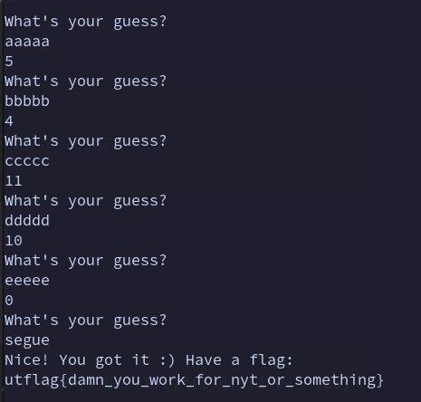

## Overview

As the name suggests, the challenge is a Wordle clone. Thought it's a simple game of guessing, within lies a nuanced mathematical pattern unveiled through some elementary Group Theory.


## Jumping to the source code
```py
#!/usr/bin/env python3
import random

wordlist = open('/src/wordlist.txt', 'r').read().split('\n')

for word in wordlist:
    assert len(word) == 5
    for letter in word:
        assert letter in 'abcdefghijklmnopqrstuvwxyz'

answer = random.choice(wordlist)

num_guesses = 0
while True:
    num_guesses += 1

    print("What's your guess?")
    guess = input().lower()

    assert len(guess) == 5
    for letter in guess:
        assert letter in 'abcdefghijklmnopqrstuvwxyz'

    if guess == answer:
        break

    response = 1
    for x in range(5):
        a = ord(guess[x]) - ord('a')
        b = ord(answer[x]) - ord('a')
        response = (response * (a-b)) % 31
    print(response)

if num_guesses <= 6:
    print('Nice! You got it :) Have a flag:')
    flag = open('/src/flag.txt', 'r').read();
    print(flag)
else:
    print(f"You took {num_guesses} tries. No flag for you :(")
```

That's a lot of code. Maybe we should go through this step-by-step...

### The magical list of words

Let's take a look at how the program chooses the word and gather hints about the secret wordlist through some analysis.

```py
wordlist = open('/src/wordlist.txt', 'r').read().split('\n')

for word in wordlist:
    assert len(word) == 5
    for letter in word:
        assert letter in 'abcdefghijklmnopqrstuvwxyz'

answer = random.choice(wordlist)

```

Recall that we do not have access to `/src/wordlist.txt`. However, peering into the code above, it's simple to deduce that for each word in this list:

- Each word has exactly 5 characters
- The character-set is limited to the lowercase alphabet

Furthermore, the `answer` is chosen randomly from this wordlist.


### How is my guess parsed???

Ignoring past some boilerplate code that ensures that our guess is valid (it has 5 characters that are lowercase ascii), we are introduced to a rather cryptic `response` variable.

```py

    print("What's your guess?")

    .
    .
    .

    response = 1
    for x in range(5):
        a = ord(guess[x]) - ord('a')
        b = ord(answer[x]) - ord('a')
        response = (response * (a-b)) % 31
    print(response)
```

Once again, let's check this out line-by-line. There is a for loop that runs 5 times. In each iteration,
- `a`: contains the alphabet position of the `i`th character of our `guess`. (a == 0, b == 1, c == 2, ..., z == 25)
- `b`: contains the alphabet position of the `i`th character of the `answer`.
- `response`: set to ((previous response) * (a - b)) (mod 31).


Hmmm, `a - b` seems to be the distance/difference between the answer and the guess at each character. It seems like `response` is the product of all these distances. 


Oh! since there are 5 variables (each character in the word) and 5 test words or equations (the sixth and final guess is reserved for the correct answer), I can just use some simple equation solving skills to get my answer, can't I? 

*sighs*. While that is on the right track, we have failed to consider that there is a pesky (mod 31)...


WAIT. Mathematicians who are smarter than me have found a way to solve this already!

## RAH! WHAT THE HECK IS A GROUP THEORY!!! 🦅🦅🦅🦅

Like I stated earlier, it turns out there is a way to mathematically solve (non-linear) equations of 5 variables under a modulus. 

A fancy group theory way of putting this problem is that "we need to solve a system of equations over a Finite Field".

Finite Field or a Galois Field is a handy structure that allows us to describe modular congruences. `GF(n)` is a Galois Field where all the elements of this set/field can be described as integers mod n. A really popular field is `GF(2)` which has two elements `{0, 1}` for binary equations. In this case, we will be operating under the field `GF(31)` since the variables we are solving for are encoded by mod 31 in the equations.

Obviously, it's a **lot** more complicated than I make it out to be. However, I am simply going to provide enough information to follow along with this writeup.

Before I continue, it might be useful to talk about what I mean by the equations.

## Making our own equations 

Suppose the answer was `serum` and our guess was `aaaaa`. 

When we enter our guess, we get a response of `27`.

Let's describe our response in terms of our unknown, $ans$. Note that all of this is under $GF(31)$. (remember that a == 0, b == 1, c == 2, ...)

$$response_{aaaaa} = (0 - ans_0) \cdot (0 - ans_1) \cdot (0 - ans_2) \cdot (0 - ans_3) \cdot (0 - ans_4) = 27$$

repeating this for the guesses `bbbbb`, `ccccc`, `ddddd`, `eeeee`, we get the following equations

$$response_{bbbbb} = (1 - ans_0) \cdot (0 - ans_1) \cdot (1 - ans_2) \cdot (1 - ans_3) \cdot (1 - ans_4) = 18$$
$$response_{ccccc} = (2 - ans_0) \cdot (1 - ans_1) \cdot (2 - ans_2) \cdot (2 - ans_3) \cdot (2 - ans_4) = 28$$
$$response_{ddddd} = (3 - ans_0) \cdot (2 - ans_1) \cdot (3 - ans_2) \cdot (2 - ans_3) \cdot (3 - ans_4) = 17$$
$$response_{eeeee} = (4 - ans_0) \cdot (3 - ans_1) \cdot (4 - ans_2) \cdot (3 - ans_3) \cdot (4 - ans_4) = 0$$


## AHHH! what do you mean there's more. A polynomial ring?


Okay so quick concept, a Polynomial Ring over a field is a structure that contains polynomials under a specifc field. So pretty much exactly what we need to describe the equations we made above. 

The important part about this is something called an **Ideal**. This is a list of polynomial in this "polynomial ring" that are always equal to zero. We can rewrite our equations to fit this definition.

Our ideal has 5 polynomials under $GF(31)$. 
$$(0 - ans_0) \cdot (0 - ans_1) \cdot (0 - ans_2) \cdot (0 - ans_3) \cdot (0 - ans_4) - 27$$
$$(1 - ans_0) \cdot (0 - ans_1) \cdot (1 - ans_2) \cdot (1 - ans_3) \cdot (1 - ans_4) - 18$$
$$(2 - ans_0) \cdot (1 - ans_1) \cdot (2 - ans_2) \cdot (2 - ans_3) \cdot (2 - ans_4) - 28$$
$$(3 - ans_0) \cdot (2 - ans_1) \cdot (3 - ans_2) \cdot (2 - ans_3) \cdot (3 - ans_4) - 17$$
$$(4 - ans_0) \cdot (3 - ans_1) \cdot (4 - ans_2) \cdot (3 - ans_3) \cdot (4 - ans_4) - 0$$


Technically, these are polynomials not equations, so we make the RHS zero and ignore it. 


Now, it's a simple step of using `sagemath` to solve for this and BOOM we have our answer. 

### There's always a caveat ;-; 
The caveat is that due to the nature of my guesses being the same letter repeated 5 times, the characters for the answer are out of order too. 

Using this sage script. We can solve for `a, b, c, d, e` (the characters of the answers). 

```py
sage: R.<a,b,c,d,e> = PolynomialRing(GF(31))
sage: Id = Ideal((0-a)*(0-b)*(0-c)*(0-d)*(0-e) - 27, (1-a)*(1-b)*(1-c)*(1-d)*(1-e) - 18, (2-a)*
....: (2-b)*(2-c)*(2-d)*(2-e) - 28, (3-a)*(3-b)*(3-c)*(3-d)*(3-e) - 17, (4-a)*(4-b)*(4-c)*(4-d)
....: *(4-e))
sage: Id.variety()[0]
```

The Variety of an Ideal is a mapping of values `a, b, c, d, e` that satisfy the polynomials of the ideal such that they are always equal to zero. There are multiple answers (which are all permuations of the same answer). We only need one.

We get that

```
{e: 20, d: 18, c: 17, b: 12, a: 4}

```

converting this we get:
```
emrsu
```

Through this for our final guess, we can wordle this out to be `serum` and get our flag. (You just gotta be good at guessing lol). 


My solve:




## Conclusion

It's a fun chall and I have the solve scripts in the same repo if you want to see it. Group theory is weird but pretty fun!!!


